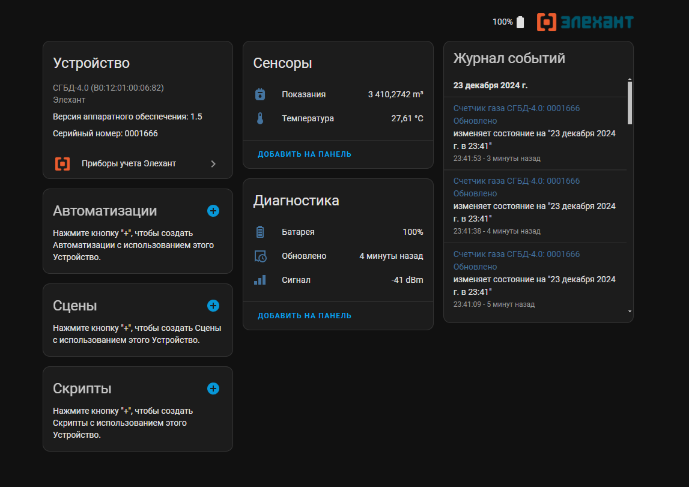

# elehant_meter
Компонент интеграции счётчиков ресурсов от Элехант с Home Assistant.

Подробнее можно почитать [тут](https://orycan.ru/blog/post/elehant_meter)

## Требования
* Для интеграции требуется наличие Bluetooth модуля в сервере HA.
* Модуль тестировался при использовании esphome esp32-bluetooth-proxy, так же должен работать с физическим адаптером bluetooth
* Код для работы с известными счетчиками добавлен, но не проверялся т.к. у автора нет этих счетчиков 

## Поддерживаются
* СГБ-1.8 - работает
* СГБ-3.2 - работает
* СГБ-4.0 - работает
* СГБ-6.0
* СГБ-1.6
* СГБД-1.8
* СГБД-3.2 - работает
* СГБД-4.0
* СГБД-6.0
* СГБД-1.6
* СОНИК-G1.6
* СОНИК-G2.5
* СОНИК-G4 - работает
* СОНИК-G6
* СОНИК-G10
* СГБД-1.8ТК
* СГБД-3.2ТК
* СГБД-4.0ТК
* СГБД-6.0ТК
* СГБД-1.6ТК
* СОНИК-G16ТК
* СОНИК-G25ТК
* СОНИК-G4ТК
* СОНИК-G6ТК
* СОНИК-G10ТК
* СГБ-1.8ТК
* СГБ-3.2ТК
* СГБ-4.0ТК
* СГБ-6.0ТК
* СГБ-1.6ТК
* СВД-15 - работает
* СВД-20
* СВТ-15
* СВТ-15 - работает
* СВТ-20
* СВТ-20
* СЭБ
* СТБ-10


## Установка
### В ручную
Скопируйте папку **elehant_meter** в **custom_components** в корне конфигурации Home Assistant

### Через HACS (в работе)
```HACS > Интеграции > 3 точки (правый верхний угол) > Пользовательские репозитории > Вводим: Zud71/elehant_meter, Категория: Интеграция > Добавить > подождать > elehant_meter > Установить```


_Для меня это первая разработка интеграции для  Home Assistant и первое знакомство с языком Python так, что не судите строго. Данная интеграция это «я его слепила из того что было» )))
Изобретать свой велосипед пришлось из-за того, что имеющиеся интеграции не поддерживают esp32-bluetooth-proxy_

  ____

## Скриншоты


